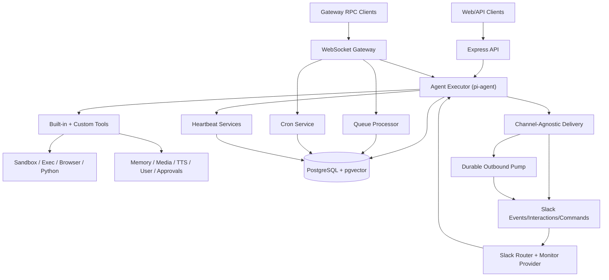

# Architecture

## Purpose

AVA is a multi-surface agent runtime with:

- synchronous HTTP chat,
- asynchronous WebSocket RPC,
- Slack-native interaction,
- background queue/cron/heartbeat execution,
- durable outbound delivery and idempotency.

The same core execution engine is reused across these surfaces.

## High-Level Topology

## Runtime Entry Points

- Process bootstrap: `src/index.ts`
- HTTP server composition: `src/api/server.ts`
- Gateway WebSocket server: `src/gateway/server.ts`
- Slack ingress shim: `src/api/routes/slack.ts`
- Active Slack runtime: `src/slack/monitor/runtime.ts`

## Core Execution Engine

The execution core is `src/agent/executor-pi.ts`.

It is responsible for:

- loading conversation history from Postgres (`PostgresSessionAdapter`),
- task complexity classification and model routing,
- context pruning and compaction safeguards,
- dynamic system prompt assembly (skills, memory, workspace context, tool list),
- tool wiring via `src/agent/pi-converter.ts`,
- sandbox context resolution (required/fail-closed when enabled),
- streaming event translation to API/Gateway/Slack callbacks,
- message persistence, usage tracking, and memory extraction,
- fallback logic (thinking downgrade, model failover, context overflow handling).

## Transport Surfaces

### HTTP API

- Route root: `/api/ava/*` (configurable).
- Chat route streams SSE from executor.
- Sessions route performs CRUD/archival operations.
- Bearer auth enforced by `requireHttpAuth` unless disabled.

Key files:

- `src/api/routes/chat.ts`
- `src/api/routes/sessions.ts`
- `src/middlewares/auth.ts`

### WebSocket Gateway (JSON-RPC style)

- Accepts RPC methods (`chat.*`, `sessions.*`, `queue.*`, `cron.*`, `browser.*`, `exec.approval.*`, plus subscription/connect lifecycle).
- Broadcasts server events with subscription filters.
- Starts/stops queue + cron background services with gateway lifecycle.

Key files:

- `src/gateway/server.ts`
- `src/gateway/runtime.ts`
- `src/gateway/protocol/*`
- `src/gateway/methods/*`

### Slack Surface

- Signature-verified ingress and immediate ACK in API route.
- Event processing delegated to monitor provider modules.
- Runtime handles debounce, dedupe, session binding, slash commands, queue steering modes, media hydration, typing/reactions, and reply dispatch.

Key files:

- `src/api/routes/slack.ts`
- `src/slack/monitor/provider.ts`
- `src/slack/monitor/events/messages.ts`
- `src/slack/monitor/message-handler/prepare.ts`
- `src/slack/monitor/runtime.ts`

## Background Services

- Queue processor: executes persistent queued work.
- Cron service: schedule and trigger queued runs.
- Heartbeat lifecycle/service: periodic and event-driven check-ins.
- System events queue: durable event buffering with claims.
- Outbound durable delivery pump: retry/backoff/idempotent outbound sends.

Key files:

- `src/gateway/services/queue-processor.ts`
- `src/gateway/services/cron.ts`
- `src/gateway/services/heartbeat.service.ts`
- `src/gateway/services/system-events.ts`
- `src/gateway/services/outbound-delivery-pump.ts`

## Security Model (Architecture View)

- HTTP/WS auth: HS256 JWT verification, optional issuer/audience checks.
- Slack auth: request signature verification with raw body.
- Exec security: host + policy resolution (`deny`/`allowlist`/`full`) with optional approval workflow.
- Sandbox: optional Docker isolation by mode/scope with fail-closed behavior.
- Credential storage: encrypted at rest in DB via `credential-vault`.

Key files:

- `src/lib/auth/jwt.ts`
- `src/middlewares/slack.ts`
- `src/lib/exec-approvals.ts`
- `src/sandbox/container-manager.ts`
- `src/services/credential-vault.ts`

## Stateful Components

Primary durable state is in Postgres (sessions, messages, queue, cron, memory, approvals, events, bindings, outbound jobs, idempotency).

Additional local-state components:

- in-memory coordination caches for in-flight subagent/queue abort control
- runtime in-memory maps for active runs/connections/debounce
- workspace/bootstrap files in user workspace (`AGENTS.md`, `SOUL.md`, `TEAM.md`, `IDENTITY.md`)

## Startup And Shutdown Lifecycle

Startup (`src/index.ts`):

1. Validate sandbox runtime if sandbox mode is enabled.
2. Verify DB connectivity.
3. Restore subagent run state from DB-backed registry services.
4. Clean stale system/outbound artifacts and wake outbound pump.
5. Initialize hooks and periodic cleanup.
6. Start HTTP API and Gateway servers.

Shutdown:

1. Stop cleanup scheduler.
2. Drain reply dispatchers, outbound pump, and active gateway runs.
3. Close gateway then HTTP.
4. Close DB pool.

## Key Architectural Constraints

- One executor logic path is reused across all channels.
- Session lifecycle state gates delivery (archived/deleted sessions are non-deliverable).
- Subagent completion delivery is direct-first, event-fallback, idempotent.
- Subagent lifecycle durability is DB-first; in-memory structures are coordination only.
- Slack markdown formatting is normalized before channel delivery across direct and durable paths.
- Queue/cron/heartbeat are durable and crash-resilient by design.
- Slack route must parse raw request body before JSON middleware for signature validation.
