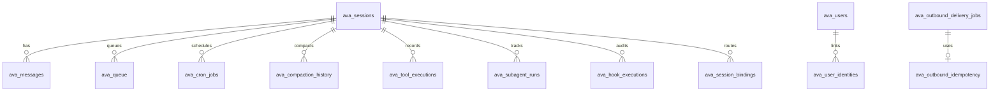

# Data Model

Database tech: PostgreSQL + Drizzle ORM + pgvector.

Schema source: `src/db/schema/*`.

## Entity Map

## Core Conversation Tables

### `ava_sessions`

Purpose:

- canonical conversation/session record across API, Gateway, Slack, subagents.

Key columns:

- `id` (uuid PK)
- `session_key` (external routing identity, indexed)
- `agent_id`, `scope`
- `user_id`
- `external_id` (unique, e.g. Slack route key)
- `source` (`web`, `slack`, `subagent`, ...)
- `status`, `lifecycle_state`
- `context_summary`
- `token_count`
- `metadata` (jsonb)
- lifecycle timestamps (`created_at`, `updated_at`, `last_message_at`, `archived_at`, `deleted_at`)

Used by:

- chat/session routes,
- gateway methods,
- Slack runtime,
- session lifecycle guard,
- heartbeat.

### `ava_messages`

Purpose:

- durable message history for executor context.

Key columns:

- `id` (uuid PK)
- `session_id` (FK -> `ava_sessions.id`, cascade delete)
- `role` (`user`, `assistant`, `system`, `tool`)
- `content`
- `tool_calls` (jsonb)
- `tool_call_id`, `name`
- `token_count`
- `is_compacted`
- `metadata`

Used by:

- `PostgresSessionAdapter`,
- history endpoints,
- compaction flows.

### `ava_compaction_history`

Purpose:

- audit trail of compaction operations.

Key columns:

- `session_id` FK
- summary + before/after token counts + message span ids.

## User, Identity, Credentials

### `ava_users`

Purpose:

- normalized user principal with role and config overrides.

Key columns:

- `id`
- `display_name`
- `role` (`owner`, `admin`, `member`)
- `config` (model/timezone/tool preferences)
- `credentials` (encrypted text payload)

### `ava_user_identities`

Purpose:

- external identity links (Slack, GitHub, etc.) to AVA users.

Key columns:

- `user_id` FK
- `provider`
- `external_id`
- `metadata`
- unique index on `(provider, external_id)`

Used by:

- user context resolver,
- approval authorization,
- Slack role commands.

## Memory And Embeddings

### `ava_memory`

Purpose:

- long-term memory entries with vector embedding.

Key columns:

- `user_id`
- `content`
- `embedding` (`vector(768)`)
- `source`, `source_id`
- `importance`
- `metadata`

### `ava_embedding_cache`

Purpose:

- avoid repeated embedding API calls for same content/provider/model.

Key columns:

- `content_hash`
- `provider`
- `model`
- `embedding`

## Queueing And Scheduling

### `ava_queue`

Purpose:

- durable work queue for async execution.

Key columns:

- `session_id` FK
- `user_id`
- `message`
- `status` (`pending`, `processing`, `completed`, `error`, `cancelled`)
- `priority`
- `mode` (`steer`, `followup`, `collect`, `interrupt`)
- `source`, `source_metadata`
- result/error fields
- run timestamps

Notes:

- Slack per-session queue steering mode (`collect|followup|steer|steer-backlog|interrupt`) is persisted in `ava_sessions.metadata.queueMode`.
- Subagent orchestration flow override (`async|supervisor`) is persisted in `ava_sessions.metadata.subagentFlowMode`.

### `ava_cron_jobs`

Purpose:

- scheduled jobs that enqueue future work.

Key columns:

- `session_id` FK
- `user_id`
- `schedule_kind` (`at`, `every`, `cron`)
- `schedule_value`
- `timezone`
- `payload`
- `enabled`, `delete_after_run`
- `next_run_at`, `last_run_at`, `last_run_status`, `run_count`

## System Events And Delivery

### `ava_system_events`

Purpose:

- persistent heartbeat/system event queue with claim semantics.

Key columns:

- `session_id`
- `session_key`
- typed fields: `kind`, `event_key`, `payload`, `lifecycle_state`
- legacy compatibility fields still readable: `type`, `text`, `context_key`
- claim fields (`claim_token`, `claimed_at`, `claim_expires_at`)
- `processed`, `processed_at`
- `expires_at`
- `metadata`

### `ava_session_bindings`

Purpose:

- active route binding for session -> channel destination.

Key columns:

- `session_id`
- `channel`
- `external_id`
- `route` json snapshot
- `status` + lifecycle timestamps
- unique `(session_id, external_id)`
- resolution indexes for `session_key`, channel/account/thread targeting and priority.

### `ava_subagent_runs`

Purpose:

- DB-first durability for async subagent lifecycle state and announce cleanup/retry metadata.
- Supervisor-mode subagents run in-band and return directly to the parent tool call; they do not rely on this table for runtime control.

Key columns:

- `run_id` (unique logical run id)
- parent/child identity fields (`parent_session_id`, `parent_session_key`, `child_session_id`, `child_session_key`)
- `user_id`, `mode`, `task`, `type`, `depth`
- terminal state fields (`status`, `result`, `error`, `ended_reason`)
- announce orchestration fields (`announce_mode`, `announce_triggered`, `cleanup_handled`, retry counters/timestamps)
- `delivery_context`, `requester_is_subagent`
- `metadata` (includes orchestration annotations such as `flowMode`)
- lifecycle timestamps (`started_at`, `ended_at`, `updated_at`)

### `ava_hook_executions`

Purpose:

- typed hook orchestration audit log for observability.

Key columns:

- `phase`, `plugin`, `priority`
- `outcome`, `latency_ms`, `error`
- correlation fields (`session_id`, `session_key`, `run_id`)
- `metadata`, `created_at`

### `ava_outbound_delivery_jobs`

Purpose:

- durable outbound send job queue.

Key columns:

- `status` (`pending`, `sending`, `retry`, `sent`, `dead`)
- `attempt_count`, `next_attempt_at`
- `session_id`
- `route_snapshot`
- `payload`
- `idempotency_key`
- claim fields + last error/provider metadata + expiry.

### `ava_outbound_idempotency`

Purpose:

- dedupe outbound deliveries by idempotency key.

Key columns:

- `idempotency_key` PK
- `state` (`pending`, `sent`)
- `delivery_job_id`
- `sent_at`
- `last_error`
- `expires_at`

## Exec Approval And Security

### `ava_exec_approvals`

Purpose:

- audit/persistence for exec approval requests and decisions.

Key columns:

- request context (`session_id`, `user_id`, `agent_id`, `command`, `cwd`, `host`, `security`, `ask`)
- resolution (`status`, `decision`, `reason`, `resolved_by`, `resolved_at`)
- `expires_at`, `metadata`

### `ava_exec_allowlist_entries`

Purpose:

- persisted user/agent command allowlist patterns from `allow-always` approvals.

Key columns:

- `user_id`, `agent_id`, `pattern` (unique composite)
- provenance + last-used metadata

## Tool Telemetry

### `ava_tool_executions`

Purpose:

- tool execution records for diagnostics/audit.

Key columns:

- `session_id` FK
- `message_id` FK (nullable)
- `user_id`
- `tool_name`
- input/output payloads
- duration, status, error

## Operational Notes

- Tables are intentionally denormalized in selected places (`metadata`, `route_snapshot`, `payload`) to keep channel/tool-specific evolution fast.
- Session lifecycle state is authoritative for whether async delivery is allowed.
- Claim-token patterns are used in both system-events and outbound jobs to safely process work in multi-worker scenarios.
- Vector indexes for memory embeddings may require raw SQL/index tuning beyond Drizzle defaults.
