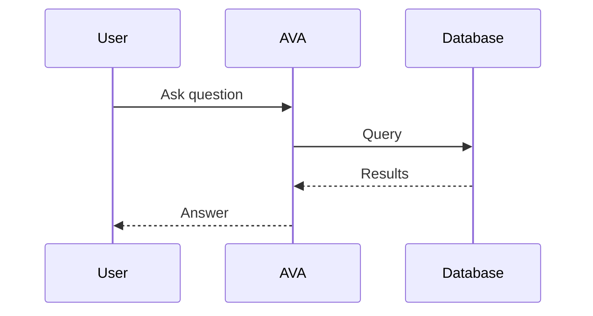

# Mermaid Diagram Skill

Render Mermaid diagrams to PNG and post them in Slack.

## Render Command

```bash
mmdc -i /tmp/diagram.mmd -o /opt/ava/.scratch/charts/diagram.png \
  -t default -b white --width 1200 \
  --puppeteerConfigFile /opt/ava/.scratch/puppeteer-config.json
```

The puppeteer config is already set up at `/opt/ava/.scratch/puppeteer-config.json`.

## Workflow

1. Write Mermaid syntax to `/tmp/diagram.mmd`
2. Run `mmdc` to render to `/opt/ava/.scratch/charts/<name>.png`
3. Upload via `slack_message` with `filePath`

## Supported Diagram Types

- `graph TD` / `graph LR` — flowcharts
- `sequenceDiagram` — sequence diagrams
- `erDiagram` — entity-relationship
- `classDiagram` — class/object relationships
- `gantt` — timelines
- `pie` — pie charts
- `stateDiagram-v2` — state machines

## Example



## Tips

- Use descriptive node labels
- Keep diagrams focused — split complex flows into multiple diagrams
- For dark themes use `-t dark`
- Increase `--width` for wide diagrams (default 1200)
- Always save output to `/opt/ava/.scratch/charts/` (gitignored)
